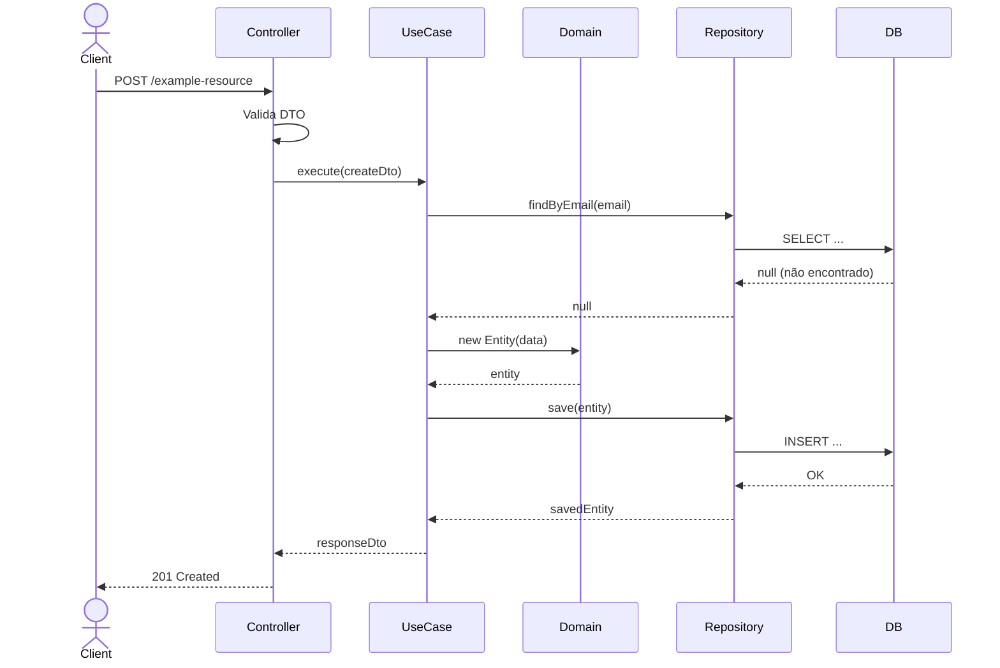

# System Feature Flows

> Registro histórico e incremental dos fluxos internos de cada funcionalidade.
> Este documento cresce a cada nova feature implementada e **nunca tem seções removidas**.

---

## Índice

<!-- Atualize este índice a cada nova feature adicionada -->

- [Visão Geral da Arquitetura](#visão-geral-da-arquitetura)
- [Convenções deste Documento](#convenções-deste-documento)
- [Feature: [Nome da Feature]](#feature-nome-da-feature)

---

## Visão Geral da Arquitetura

> Descreva aqui a arquitetura geral do sistema — uma vez, no topo. As features abaixo assumem esse contexto.

**Padrão arquitetural:** Clean Architecture / Hexagonal / MVC (escolha o seu)

**Fluxo global de uma requisição:**

```
HTTP Request
    └── Controller (Presentation)
            └── Use Case (Application)
                    ├── Domain Entity / Domain Service
                    └── Repository / Gateway (Infra)
                              └── Database / API Externa
```

**Camadas e responsabilidades:**

| Camada         | Responsabilidade                                                  |
|----------------|-------------------------------------------------------------------|
| `presentation` | Receber requisições, validar DTOs, formatar resposta              |
| `application`  | Orquestrar o caso de uso, coordenar domínio e infra               |
| `domain`       | Regras de negócio puras, entidades, value objects, domain events  |
| `infra`        | Persistência, integrações externas, providers, adaptadores        |

---

## Convenções deste Documento

- **Erros de domínio** são lançados como exceções tipadas (ex: `OrderNotFoundException`)
- **Erros de infra** são capturados e relançados como erros de aplicação
- **Transações de banco** são gerenciadas no nível do use case, não do repository
- **DTOs** trafegam entre presentation ↔ application; **Entidades** entre application ↔ domain

---
---

# Feature: [Nome da Funcionalidade]

> **Versão:** 1.0.0
> **Implementada em:** YYYY-MM-DD
> **Status:**  Concluída |  Em andamento |  Em teste

---

## Resumo

Descreva em 2–3 frases o **problema** que essa feature resolve e o **valor** que ela entrega.

**Motivação:** Por que essa feature foi criada? Qual era a dor antes dela?
**Resultado:** O que mudou no sistema após sua implementação?

---

## Fluxo Principal

### 1. Ponto de Entrada

- **Tipo:** HTTP REST / Job agendado / Evento de mensageria / CLI
- **Arquivo:** `src/presentation/controllers/ExampleController.ts`
- **Rota/Evento:** `POST /example-resource`
- **Autenticação:** JWT obrigatório | Pública | API Key

Descreva o que acontece no momento em que o fluxo é iniciado.

---

### 2. Validação de Entrada

- **Arquivo:** `src/presentation/dtos/CreateExampleDto.ts`
- **Biblioteca:** class-validator / Joi / Zod

| Campo     | Tipo     | Obrigatório | Regra de validação              |
|-----------|----------|-------------|----------------------------------|
| `name`    | `string` |            | mínimo 3 caracteres, máximo 100  |
| `email`   | `string` |            | formato de e-mail válido         |
| `amount`  | `number` |            | maior que zero                   |

**Falha de validação:** retorna `400 Bad Request` com lista de campos inválidos.

---

### 3. Orquestração da Aplicação

- **Arquivo:** `src/application/use-cases/CreateExampleUseCase.ts`

Descreva em passos o que o use case executa:

1. Verifica se o recurso já existe (evita duplicatas)
2. Cria a entidade de domínio via factory method
3. Persiste via repository
4. Publica evento de domínio (se aplicável)
5. Retorna o DTO de resposta

---

### 4. Regras de Negócio

> Documente as decisões de domínio — o "porquê" das regras, não apenas o "o quê".

| Regra | Descrição | Localização no Código |
|-------|-----------|----------------------|
| Unicidade por e-mail | Cada usuário deve ter e-mail único no sistema | `src/domain/entities/User.ts` |
| Pedido mínimo | Valor do pedido deve ser maior que R$ 0,01 | `src/domain/entities/Order.ts` |
| Status imutável | Pedido cancelado não pode ser reativado | `src/domain/entities/Order.ts` |

---

### 5. Persistência / Integrações

**Repositórios utilizados:**

| Repository | Operação | Arquivo |
|------------|----------|---------|
| `UserRepository` | `findByEmail()`, `save()` | `src/infra/database/repositories/UserRepository.ts` |

**Integrações externas:**

| Serviço | Operação | Timeout | Retry |
|---------|----------|---------|-------|
| SendGrid | Envio de e-mail de boas-vindas | 5s | 3x |
| ViaCEP | Validação de endereço | 3s | 1x |

---

### 6. Resposta Final

**Sucesso — `201 Created`:**

```json
{
  "id": "uuid-aqui",
  "name": "Nome do Recurso",
  "createdAt": "2024-01-15T10:30:00Z"
}
```

**Campos retornados:**

| Campo | Tipo | Descrição |
|-------|------|-----------|
| `id` | `string (UUID)` | Identificador único do recurso |
| `name` | `string` | Nome informado pelo usuário |
| `createdAt` | `ISO 8601` | Data/hora de criação |

---

## Fluxos Alternativos e Erros

| Cenário | HTTP Status | Código de Erro | Mensagem |
|---------|-------------|----------------|----------|
| Dados inválidos (DTO) | `400` | `VALIDATION_ERROR` | Lista dos campos com erro |
| Recurso já existe | `409` | `RESOURCE_ALREADY_EXISTS` | "Já existe um registro com este e-mail" |
| Recurso não encontrado | `404` | `RESOURCE_NOT_FOUND` | "Recurso não encontrado" |
| Falha no SendGrid | `502` | `EXTERNAL_SERVICE_ERROR` | "Falha ao enviar e-mail, tente novamente" |
| Erro de banco de dados | `500` | `INTERNAL_ERROR` | "Erro interno do servidor" |

> Todos os erros retornam o mesmo envelope:
> ```json
> { "statusCode": 409, "error": "RESOURCE_ALREADY_EXISTS", "message": "..." }
> ```

---

## Diagrama de Sequência



---

## Decisões Técnicas

### ADR-001 — [Título da Decisão]

| Campo | Detalhe |
|-------|---------|
| **Status** | Aceita |
| **Data** | YYYY-MM-DD |
| **Contexto** | Descreva o problema ou cenário que gerou a necessidade de uma decisão |
| **Decisão** | O que foi decidido e por quê |
| **Consequências** | Vantagens e desvantagens resultantes dessa escolha |

---

## Trechos de Código Relevantes

> Inclua apenas trechos que ilustrem decisões não óbvias ou padrões específicos do projeto.

**Exemplo — Proteção contra criação duplicada no use case:**

```typescript
// src/application/use-cases/CreateExampleUseCase.ts
const existing = await this.repository.findByEmail(dto.email);
if (existing) {
  throw new ResourceAlreadyExistsException('email', dto.email);
}
```

**Motivo:** A verificação de duplicata é responsabilidade do use case, não do banco (unique constraint), para garantir uma mensagem de erro controlada e tipada antes de atingir a camada de infra.

---

---

# Feature: [Próxima Funcionalidade]

> Adicione aqui a próxima feature seguindo a mesma estrutura acima.
> Nunca remova features anteriores — o documento é um registro histórico.
