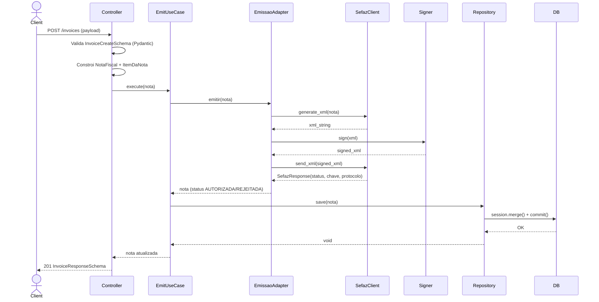
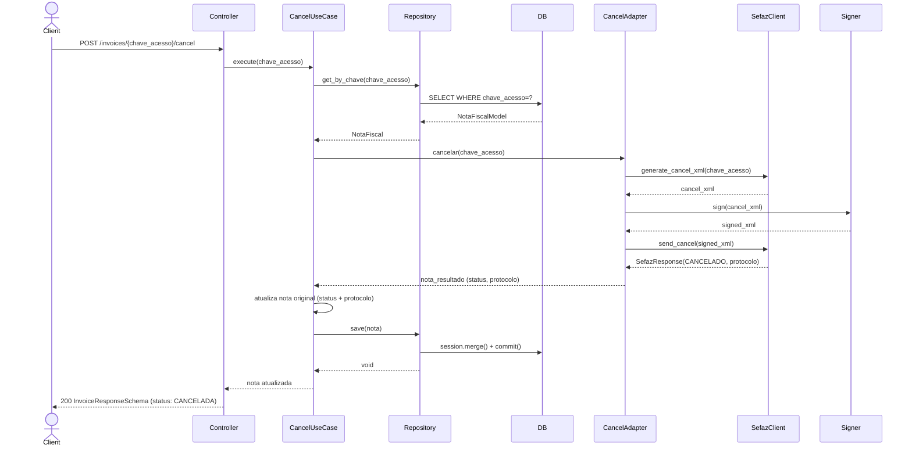
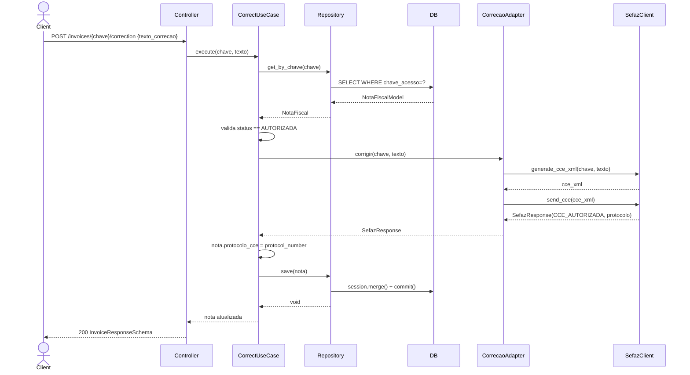

# System Feature Flows

> Registro historico e incremental dos fluxos internos de cada funcionalidade.
> Este documento cresce a cada nova feature implementada e **nunca tem secoes removidas**.

---

## Indice

- [Visao Geral da Arquitetura](#visao-geral-da-arquitetura)
- [Convencoes deste Documento](#convencoes-deste-documento)
- [Feature: Emissao de NF-e](#feature-emissao-de-nf-e)
- [Feature: Cancelamento de NF-e](#feature-cancelamento-de-nf-e)
- [Feature: Carta de Correcao Eletronica (CC-e)](#feature-carta-de-correcao-eletronica-cc-e)
- [Feature: Consulta de NF-e](#feature-consulta-de-nf-e)

---

## Visao Geral da Arquitetura

**Padrao arquitetural:** Clean Architecture

**Fluxo global de uma requisicao:**

```
HTTP Request
    └── APIRouter / Controller (app/interfaces/controllers/)
            └── Use Case (application/use_cases/)
                    ├── Domain Entity / Value Object (core/entities/, core/value_objects/)
                    └── Port Interface (core/services/ports/)
                              └── Adapter / Repository (infrastructure/adapters/)
                                        └── PostgreSQL (SQLAlchemy) / SefazClient (stub)
```

**Camadas e responsabilidades:**

| Camada           | Diretorio          | Responsabilidade                                                  |
|------------------|--------------------|-------------------------------------------------------------------|
| `presentation`   | `app/`             | Receber requisicoes HTTP, validar schemas Pydantic, montar resposta, injecao de dependencias |
| `application`    | `application/`     | Orquestrar o caso de uso, coordenar dominio e infra via ports, mapear models <-> entities |
| `domain`         | `core/`            | Regras de negocio puras, entidades, value objects, enums, excecoes tipadas, ports (ABC) |
| `infra`          | `infrastructure/`  | Adapters SQLAlchemy, cliente SEFAZ (stub), assinador digital (stub), messaging (nao implementado) |

**Modelos de dominio centrais:**

| Classe | Arquivo | Descricao |
|--------|---------|-----------|
| `NotaFiscal` | `core/entities/nota_fiscal.py` | Entidade raiz: contem itens, status, chave de acesso, protocolos |
| `ItemDaNota` | `core/entities/nota_fiscal.py` | Item de linha da NF-e com impostos proprios |
| `StatusNota` | `core/enum/status_nota.py` | `EM_PROCESSAMENTO`, `AUTORIZADA`, `REJEITADA`, `CANCELADA` |
| `CnpjCpf` | `core/value_objects/cnpjcpf.py` | Value object imutavel; valida 11 (CPF) ou 14 (CNPJ) digitos |
| `Endereco` | `core/value_objects/endereco.py` | Value object imutavel; valida CEP (8 digitos) e UF (27 estados) |
| `Imposto` | `core/value_objects/imposto.py` | Value object imutavel: ICMS, IPI, PIS, COFINS com `total_geral` |

---

## Convencoes deste Documento

- **Erros de dominio** sao lancados como excecoes tipadas (`NotaJaEmitidaException`, `NotaNaoEncontradaException`, `DomainException`)
- **Erros de infra** nao possuem tratamento proprio — propagam para o controller
- **Transacoes de banco** sao gerenciadas na camada de adapter via `session.commit()`, nao no use case
- **DTOs** de entrada trafegam do controller para o use case como entidades de dominio ja construidas (sem camada DTO intermediaria entre presentation e application)
- `SefazClient` e `Signer` sao stubs: nao ha comunicacao real com a SEFAZ

---

# Feature: Emissao de NF-e

> **Versao:** 1.0.0
> **Implementada em:** 2025-06-14
> **Status:** Concluida (integracao SEFAZ e assinatura sao stubs)

---

## Resumo

Permite emitir uma NF-e a partir dos dados do emitente, destinatario e itens. O servico monta a entidade de dominio, aciona o adapter de emissao (que gera e assina o XML e envia a SEFAZ), e persiste o resultado com chave de acesso e protocolo de autorizacao.

**Motivacao:** Centralizar a emissao de NF-e em um microsservico isolado, com regras de dominio e validacoes desacopladas da infra.
**Resultado:** A NF-e e persistida com status `AUTORIZADA` ou `REJEITADA` e retornada ao cliente com todos os campos preenchidos.

---

## Fluxo Principal

### 1. Ponto de Entrada

- **Tipo:** HTTP REST
- **Arquivo:** `app/interfaces/controllers/invoice_controller.py`
- **Rota:** `POST /invoices`
- **Autenticacao:** Publica (TODO: implementar autenticacao)

O controller recebe o payload JSON, valida via schema Pydantic (`InvoiceCreateSchema`), constroi a entidade `NotaFiscal` e seus `ItemDaNota`, e repassa ao use case.

---

### 2. Validacao de Entrada

- **Arquivo:** `app/interfaces/controllers/invoice_controller.py` (schemas inline)
- **Biblioteca:** Pydantic v2

| Campo | Tipo | Obrigatorio | Regra de validacao |
|-------|------|-------------|---------------------|
| `emitente_cnpj` | `string` | sim | exatamente 14 digitos (`^\d{14}$`) |
| `destinatario_cnpj` | `string` | sim | exatamente 14 digitos (`^\d{14}$`) |
| `emitente_endereco.uf` | `string` | sim | 2 letras maiusculas (`^[A-Z]{2}$`) |
| `emitente_endereco.cep` | `string` | sim | 8 digitos (`^\d{8}$`) |
| `itens[].sku` | `string` | sim | 3-10 chars alfanumericos maiusculos (`^[A-Z0-9]{3,10}$`) |
| `itens[].quantidade` | `int` | sim | maior que 0 |
| `itens[].valor_unitario` | `float` | sim | maior que 0.0 |
| `itens[].cfop` | `string` | sim | 4 digitos (`^\d{4}$`) |
| `itens[].ncm` | `string` | sim | 8 digitos (`^\d{8}$`) |
| `itens[].cst` | `string` | sim | 3 digitos (`^\d{3}$`) |
| `itens[].impostos` | `dict[str, float]` | sim | chaves livres, valores >= 0.0 |
| `itens` | `list` | sim | minimo 1 item |

Alem da validacao Pydantic, os value objects `CnpjCpf` e `Endereco` lancam `ValueError` em caso de dados invalidos, que propagam como `422 Unprocessable Entity`.

**Falha de validacao:** Pydantic retorna `422` com lista de campos invalidos; erros de dominio retornam `400 Bad Request`.

---

### 3. Orquestracao da Aplicacao

- **Arquivo:** `application/use_cases/emit_invoice.py`

1. Recebe a entidade `NotaFiscal` ja construida
2. Chama `EmissaoNotaPort.emitir(nota)` — delega ao adapter
3. O adapter (`NotaFiscalEmissaoAdapter`) gera o XML via `SefazClient.generate_xml()`, assina via `Signer.sign()`, envia via `SefazClient.send_xml()`
4. Se `response.status == 'AUTORIZADO'`: preenche `chave_acesso`, `protocolo_autorizacao`, status `AUTORIZADA`; caso contrario: status `REJEITADA`
5. Chama `NotaFiscalRepository.save(nota_emitida)` para persistir
6. Retorna a entidade atualizada

---

### 4. Regras de Negocio

| Regra | Descricao | Localizacao |
|-------|-----------|-------------|
| CNPJ/CPF valido | Deve ter 11 (CPF) ou 14 (CNPJ) digitos; digito verificador nao validado (TODO) | `core/value_objects/cnpjcpf.py` |
| CEP valido | Deve ter 8 digitos numericos | `core/value_objects/endereco.py` |
| UF valida | Deve ser uma das 27 siglas brasileiras | `core/value_objects/endereco.py` |
| Itens obrigatorios | Lista de itens nao pode ser vazia | `app/interfaces/controllers/invoice_controller.py` |
| Status inicial | Toda NF-e inicia com `EM_PROCESSAMENTO` | `core/entities/nota_fiscal.py` |

---

### 5. Persistencia / Integracoes

**Repositorios utilizados:**

| Repository | Operacao | Arquivo |
|------------|----------|---------|
| `NotaFiscalSqlAlchemyAdapter` | `save()` — usa `session.merge()` + `session.commit()` | `infrastructure/adapters/nota_fiscal_sqlalchemy.py` |

**Integracoes externas (stubs):**

| Servico | Operacao | Observacao |
|---------|----------|------------|
| `SefazClient` | `generate_xml()`, `send_xml()` | Stub: retorna chave de 44 chars e protocolo aleatorio; TODO implementar XML real |
| `Signer` | `sign()` | Stub: envolve XML em `<signed>...</signed>`; TODO implementar com xmlsec/PyKCS11 |

---

### 6. Resposta Final

**Sucesso — `201 Created`:**

```json
{
  "id": "uuid-v4",
  "chave_acesso": "44 caracteres alfanumericos",
  "status": "AUTORIZADA",
  "data_emissao": "2025-06-14T21:00:00",
  "protocolo_autorizacao": "123456789",
  "protocolo_cce": null,
  "emitente_cnpj": "12345678000199",
  "destinatario_cnpj": "98765432000100",
  "emitente_endereco": { "logradouro": "...", "numero": "...", "municipio": "...", "uf": "SP", "cep": "01001000" },
  "destinatario_endereco": { "..." },
  "impostos_totais": null,
  "itens": [
    {
      "sku": "ABC123",
      "descricao": "Produto Teste",
      "quantidade": 2,
      "valor_unitario": 50.0,
      "cfop": "5102",
      "ncm": "12345678",
      "cst": "102",
      "impostos": { "icms": 10.0, "ipi": 5.0, "pis": 0.0, "cofins": 0.0 },
      "total": 100.0
    }
  ]
}
```

**Campos retornados:**

| Campo | Tipo | Descricao |
|-------|------|-----------|
| `id` | `UUID` | Identificador interno da NF-e |
| `chave_acesso` | `string(44)` | Chave de acesso gerada pela SEFAZ |
| `status` | `string` | `AUTORIZADA` ou `REJEITADA` |
| `protocolo_autorizacao` | `string` | Numero do protocolo SEFAZ |
| `itens[].total` | `float` | `quantidade * valor_unitario` (calculado no controller) |

---

## Fluxos Alternativos e Erros

| Cenario | HTTP Status | Descricao |
|---------|-------------|-----------|
| Dados invalidos (Pydantic) | `422` | Lista de campos com erro de validacao |
| Erro de dominio (CNPJ invalido, CEP invalido) | `422` | ValueError dos value objects |
| Excecao de dominio | `400` | `DomainException` capturada no controller |
| Erro interno | `500` | Excecoes nao tratadas (sem handler global configurado) |

---

## Diagrama de Sequencia



---

## Decisoes Tecnicas

### ADR-001 — Entidade construida no controller, nao no use case

| Campo | Detalhe |
|-------|---------|
| **Status** | Aceita |
| **Data** | 2025-06-14 |
| **Contexto** | O controller recebe um schema Pydantic e precisa transformar em entidade de dominio antes de chamar o use case |
| **Decisao** | A construcao da entidade `NotaFiscal` e dos value objects ocorre diretamente no controller, sem camada DTO de aplicacao intermediaria |
| **Consequencias** | Simplifica o codigo mas acopla ligeiramente a camada de apresentacao ao dominio; o use case recebe a entidade pronta |

### ADR-002 — Stubs para SefazClient e Signer

| Campo | Detalhe |
|-------|---------|
| **Status** | Aceita (temporariamente) |
| **Data** | 2025-06-14 |
| **Contexto** | Integracao com SEFAZ requer certificado digital e homologacao; estava fora do escopo inicial |
| **Decisao** | `SefazClient` retorna chave e protocolo aleatorios; `Signer` apenas envolve o XML sem assinar |
| **Consequencias** | Permite testar o fluxo ponta a ponta sem infra real; deve ser substituido antes de ir a producao |

---

---

# Feature: Cancelamento de NF-e

> **Versao:** 1.0.0
> **Implementada em:** 2025-06-14
> **Status:** Concluida (integracao SEFAZ e assinatura sao stubs)

---

## Resumo

Permite cancelar uma NF-e ja autorizada usando sua chave de acesso. O servico recupera a nota do banco, aciona o adapter de cancelamento (que gera e assina o XML de cancelamento e envia a SEFAZ), atualiza o status e protocolo na entidade original, e persiste o resultado.

**Motivacao:** Atender ao fluxo fiscal de cancelamento de NF-e dentro do prazo legal.
**Resultado:** A NF-e tem seu status alterado para `CANCELADA` (ou `REJEITADA` se a SEFAZ rejeitar) e o protocolo de cancelamento e armazenado.

---

## Fluxo Principal

### 1. Ponto de Entrada

- **Tipo:** HTTP REST
- **Arquivo:** `app/interfaces/controllers/invoice_controller.py`
- **Rota:** `POST /invoices/{chave_acesso}/cancel`
- **Autenticacao:** Publica (TODO: implementar autenticacao)

---

### 2. Validacao de Entrada

| Campo | Tipo | Obrigatorio | Regra |
|-------|------|-------------|-------|
| `chave_acesso` | `string` (path param) | sim | Chave de acesso da NF-e (44 chars) |

---

### 3. Orquestracao da Aplicacao

- **Arquivo:** `application/use_cases/cancel_invoice.py`

1. Busca a `NotaFiscal` pelo `chave_acesso` via `NotaFiscalRepository.get_by_chave()`
2. Se nao encontrada: lanca `NotaNaoEncontradaException`
3. Chama `CancelamentoNotaPort.cancelar(chave_acesso)` — delega ao adapter
4. O adapter gera XML de cancelamento, assina e envia a SEFAZ
5. Atualiza `nota.status` e `nota.protocolo_autorizacao` com os valores do resultado
6. Persiste a entidade atualizada via `repository.save(nota)`
7. Retorna a entidade

**Observacao:** O adapter cria uma `NotaFiscal` temporaria com `cnpj=None` e `endereco=None` apenas para trafegar status e protocolo de volta ao use case. Isso viola invariantes da entidade (BUG-02).

---

### 4. Regras de Negocio

| Regra | Descricao | Localizacao |
|-------|-----------|-------------|
| Nota deve existir | Cancelamento so e possivel para notas ja persistidas | `application/use_cases/cancel_invoice.py` |
| Status resultante | `CANCELADA` se SEFAZ retornar `CANCELADO`; `REJEITADA` caso contrario | `infrastructure/adapters/cancelamento_nota_adapter.py` |

---

### 5. Persistencia / Integracoes

**Repositorios utilizados:**

| Repository | Operacao | Arquivo |
|------------|----------|---------|
| `NotaFiscalSqlAlchemyAdapter` | `get_by_chave()`, `save()` | `infrastructure/adapters/nota_fiscal_sqlalchemy.py` |

**Integracoes externas (stubs):**

| Servico | Operacao | Observacao |
|---------|----------|------------|
| `SefazClient` | `generate_cancel_xml()`, `send_cancel()` | Stub: sempre retorna `CANCELADO` |
| `Signer` | `sign()` | Stub |

---

### 6. Resposta Final

**Sucesso — `200 OK`:** Retorna `InvoiceResponseSchema` com `status: "CANCELADA"`.

---

## Fluxos Alternativos e Erros

| Cenario | HTTP Status | Descricao |
|---------|-------------|-----------|
| Nota nao encontrada | `404` | `NotaNaoEncontradaException` mapeada no controller |

---

## Diagrama de Sequencia



---

---

# Feature: Carta de Correcao Eletronica (CC-e)

> **Versao:** 1.0.0
> **Implementada em:** 2025-06-14
> **Status:** Concluida (integracao SEFAZ e stub de protocolo_cce tem bug no modelo)

---

## Resumo

Permite emitir uma Carta de Correcao Eletronica para uma NF-e autorizada. A CC-e nao cancela nem reemite a nota — apenas registra uma correcao textual junto a SEFAZ. Somente notas com status `AUTORIZADA` podem receber CC-e.

**Motivacao:** Corrigir informacoes nao criticas de uma NF-e sem necessidade de cancelamento.
**Resultado:** O campo `protocolo_cce` da nota e atualizado com o numero de protocolo retornado pela SEFAZ.

---

## Fluxo Principal

### 1. Ponto de Entrada

- **Tipo:** HTTP REST
- **Arquivo:** `app/interfaces/controllers/invoice_controller.py`
- **Rota:** `POST /invoices/{chave_acesso}/correction`
- **Autenticacao:** Publica (TODO: implementar autenticacao)

---

### 2. Validacao de Entrada

| Campo | Tipo | Obrigatorio | Regra |
|-------|------|-------------|-------|
| `chave_acesso` | `string` (path param) | sim | Chave de acesso da NF-e |
| `texto_correcao` | `string` (body) | sim | 1 a 500 caracteres |

---

### 3. Orquestracao da Aplicacao

- **Arquivo:** `application/use_cases/correct_invoice.py`

1. Busca a `NotaFiscal` pelo `chave_acesso` via repositorio
2. Se nao encontrada: lanca `NotaNaoEncontradaException`
3. Valida que `nota.status == StatusNota.AUTORIZADA`; caso contrario lanca `DomainException`
4. Chama `CartaCorrecaoPort.corrigir(chave_acesso, texto_correcao)`
5. Atualiza `nota.protocolo_cce = resultado.protocol_number`
6. Persiste e retorna

**Observacao:** `protocolo_cce` nao esta mapeado no `NotaFiscalModel` SQLAlchemy — a persistencia falha silenciosamente (BUG-01).

---

### 4. Regras de Negocio

| Regra | Descricao | Localizacao |
|-------|-----------|-------------|
| Apenas notas autorizadas | CC-e so pode ser emitida para `status == AUTORIZADA` | `application/use_cases/correct_invoice.py` |
| Nota deve existir | `NotaNaoEncontradaException` se chave nao encontrada | `application/use_cases/correct_invoice.py` |

---

### 5. Persistencia / Integracoes

**Repositorios utilizados:**

| Repository | Operacao | Arquivo |
|------------|----------|---------|
| `NotaFiscalSqlAlchemyAdapter` | `get_by_chave()`, `save()` | `infrastructure/adapters/nota_fiscal_sqlalchemy.py` |

**Integracoes externas (stubs):**

| Servico | Operacao | Observacao |
|---------|----------|------------|
| `SefazClient` | `generate_cce_xml()`, `send_cce()` | Stub: retorna `CCE_AUTORIZADA` e protocolo aleatorio |

---

### 6. Resposta Final

**Sucesso — `200 OK`:** Retorna `InvoiceResponseSchema` com `protocolo_cce` preenchido.

---

## Fluxos Alternativos e Erros

| Cenario | HTTP Status | Descricao |
|---------|-------------|-----------|
| Nota nao encontrada | `404` | `NotaNaoEncontradaException` mapeada no controller |
| Nota nao autorizada | `400` | `DomainException("Somente notas autorizadas podem receber Carta de Correcao.")` |

---

## Diagrama de Sequencia



---

---

# Feature: Consulta de NF-e

> **Versao:** 1.0.0
> **Implementada em:** 2025-06-14
> **Status:** Concluida

---

## Resumo

Oferece dois endpoints de leitura: listagem de todas as NF-es persistidas e busca individual por chave de acesso. Operacoes somente leitura sem regras de dominio.

**Motivacao:** Permitir que outros servicos ou o frontend consultem o estado das NF-es sem acionar fluxos de emissao.
**Resultado:** Dados persistidos sao retornados no mesmo formato (`InvoiceResponseSchema`) usado nos fluxos de escrita.

---

## Fluxo Principal

### 1. Endpoints

| Rota | Descricao |
|------|-----------|
| `GET /invoices` | Lista todas as `NotaFiscal` via `repository.list_all()` |
| `GET /invoices/{chave_acesso}` | Busca unica via `repository.get_by_chave()` |

Ambos utilizam `NotaFiscalSqlAlchemyAdapter` diretamente (sem use case intermediario).

---

### 2. Persistencia

| Repository | Operacao | Arquivo |
|------------|----------|---------|
| `NotaFiscalSqlAlchemyAdapter` | `list_all()` — `session.query(NotaFiscalModel).all()` | `infrastructure/adapters/nota_fiscal_sqlalchemy.py` |
| `NotaFiscalSqlAlchemyAdapter` | `get_by_chave()` — `query.filter_by(chave_acesso=...).one_or_none()` | `infrastructure/adapters/nota_fiscal_sqlalchemy.py` |

---

### 3. Regras

Nenhuma regra de dominio aplicada — acesso de leitura pura.

---

## Fluxos Alternativos e Erros

| Cenario | HTTP Status | Descricao |
|---------|-------------|-----------|
| Nota nao encontrada (GET por chave) | `404` | `HTTPException` lancada diretamente no controller |
| Lista vazia (GET all) | `200` | Retorna array vazio `[]` |

---

## Decisoes Tecnicas

### ADR-001 — Sem use case para consultas

| Campo | Detalhe |
|-------|---------|
| **Status** | Aceita |
| **Data** | 2025-06-14 |
| **Contexto** | Consultas de leitura nao possuem logica de dominio |
| **Decisao** | O controller acessa o repositorio diretamente para `GET /invoices` e `GET /invoices/{chave}`, sem intermediar por um use case |
| **Consequencias** | Menos boilerplate para operacoes CQRS simples; a consistencia com os fluxos de escrita e mantida pelo mesmo `InvoiceResponseSchema` |
